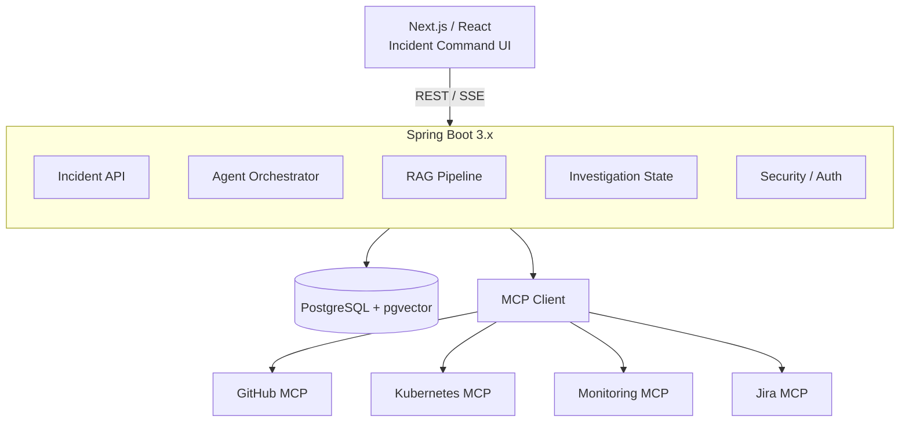
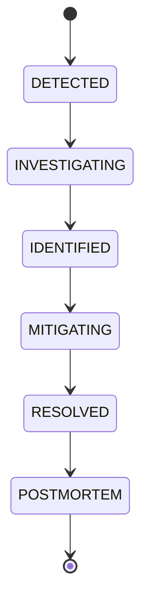
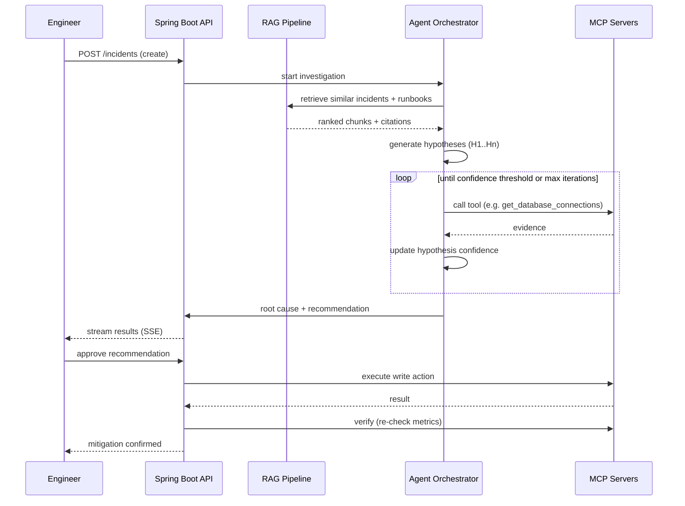
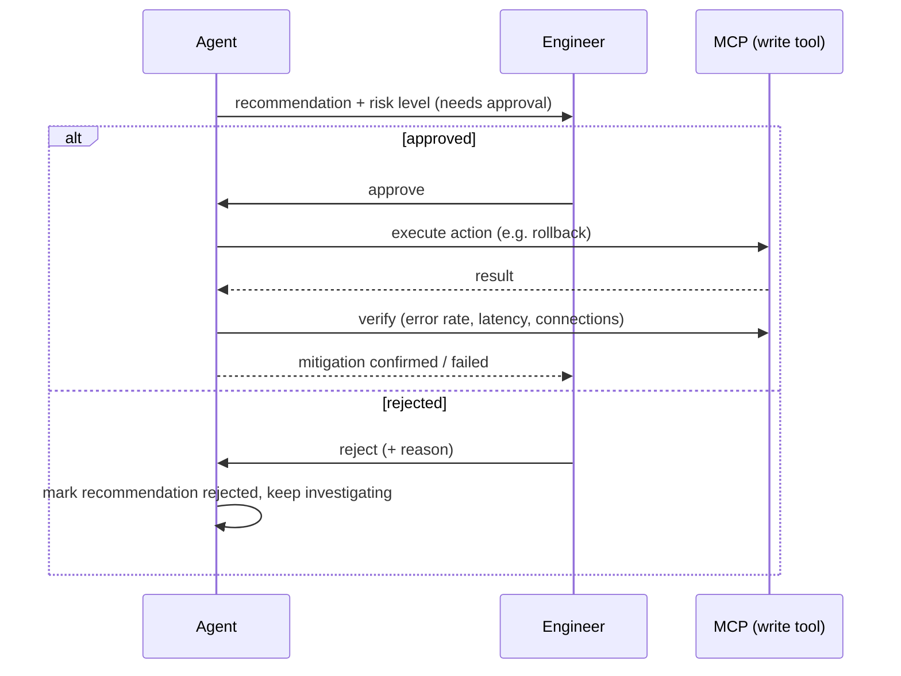

# AI Incident Investigator — Design Document

**Version:** 1.0
**Stack:** Spring Boot 3.x, Spring AI, PostgreSQL + pgvector, MCP, Next.js
**Status:** Draft for build

---

## 1. Product Overview

**One-liner:** An AI SRE platform that investigates production incidents by combining organizational knowledge (RAG) with live infrastructure evidence (MCP), builds an evidence-backed root-cause hypothesis, and recommends remediation that a human must approve before it executes.

**Core principle:**
- RAG = what the organization knows (runbooks, postmortems, ADRs, past incidents)
- MCP = what is happening right now (GitHub, Kubernetes, monitoring, Jira)
- Agent = connects the two and investigates iteratively
- Human = approves any action with real-world side effects

**Primary user:** on-call engineer / SRE who opens an incident and wants a fast, explainable root-cause hypothesis instead of manually grepping dashboards and logs.

---

## 2. Goals & Non-Goals

### Goals
- Reduce time-to-hypothesis for a production incident from ~20–40 minutes of manual digging to under a minute of AI-assisted investigation.
- Every claim the agent makes must be traceable to a specific piece of evidence (metric, log, commit, doc, prior incident).
- No irreversible/production action happens without explicit human approval.
- The system gets smarter over time: resolved incidents feed back into the knowledge base.

### Non-Goals (v1)
- Fully autonomous remediation without human-in-the-loop.
- Multi-cloud / multi-tenant SaaS — build for a single organization first.
- Replacing existing monitoring/alerting — this system consumes alerts, it doesn't generate them.

---

## 3. Functional Requirements

| # | Requirement |
|---|---|
| F1 | Create, view, update, and transition incidents through a defined lifecycle |
| F2 | Ingest documents (runbooks, postmortems, ADRs, architecture docs) into a searchable knowledge base |
| F3 | Retrieve relevant knowledge via hybrid search (semantic + metadata filters) |
| F4 | Connect to external systems (GitHub, Kubernetes, monitoring, Jira) via MCP to pull live evidence |
| F5 | Run an iterative investigation loop that generates and scores hypotheses against evidence |
| F6 | Produce a timeline correlating deployments, metrics, logs, and incident events |
| F7 | Present evidence as a traceable graph — every hypothesis links to its supporting/contradicting evidence |
| F8 | Generate a remediation recommendation with a risk level |
| F9 | Require human approval before any MCP write-action (rollback, restart, scale) executes |
| F10 | Verify remediation success by re-checking metrics after the action |
| F11 | Auto-draft a postmortem after resolution, pending human review, then feed it back into the knowledge base |
| F12 | Stream investigation progress live to the UI (SSE) |
| F13 | Track evaluation metrics (root-cause accuracy, hallucination rate, tool selection accuracy) across incidents |

---

## 4. Non-Functional Requirements

- **Explainability:** No hypothesis or recommendation without cited evidence — never show raw chain-of-thought, only structured evidence/claims.
- **Safety:** MCP tools are split into `read` and `write` categories; write tools always require an approval gate.
- **Auditability:** Every tool call, hypothesis change, and human decision is logged and immutable.
- **Latency:** Initial hypothesis within ~30–60s of investigation start; stream partial progress rather than blocking.
- **Extensibility:** New MCP servers (e.g., Slack, PagerDuty) should be addable without touching the agent's core loop.
- **Testability:** Investigation logic must be testable against a simulated environment (fake incidents), not just live systems.

---

## 5. System Architecture



**Layering inside Spring Boot:**

```
controller/        -> REST + SSE endpoints
service/
  incident/         -> lifecycle, CRUD, state transitions
  knowledge/         -> ingestion, chunking, embeddings
  retrieval/          -> hybrid search (vector + metadata)
  agent/               -> orchestrator, investigation state machine
  mcp/                 -> MCP client wrappers per server
  evidence/             -> evidence graph construction
  remediation/           -> recommendation + approval + execution
  postmortem/             -> generation + ingestion back into RAG
repository/            -> Spring Data JPA
config/                -> Spring AI, MCP, Security
```

---

## 6. Data Model

Core tables (Postgres):

```
users(id, name, email, role)
services(id, name, environment, owner_team, repo_url)

incidents(id, title, description, service_id, environment,
          severity, status, detected_by, started_at,
          created_at, resolved_at)

incident_events(id, incident_id, type, payload, source, occurred_at)
-- type: deployment | metric_spike | log_error | state_change | note

documents(id, title, type, service_id, environment, version,
          source_url, created_at)
-- type: runbook | postmortem | architecture | adr | incident_summary

document_chunks(id, document_id, content, embedding VECTOR(1536),
                 metadata JSONB, chunk_index)

investigations(id, incident_id, status, started_at, completed_at,
                summary)

hypotheses(id, investigation_id, description, confidence,
           status)  -- status: active | discarded | confirmed

evidence(id, investigation_id, hypothesis_id, type, source,
         content, supports BOOLEAN, weight)
-- type: metric | log | commit | deployment | document | prior_incident

tool_calls(id, investigation_id, mcp_server, tool_name,
           arguments JSONB, result JSONB, called_at, latency_ms)

recommendations(id, investigation_id, action, risk_level,
                 rationale, status)  -- status: pending | approved | rejected | executed

actions(id, recommendation_id, mcp_server, tool_name,
        executed_by, executed_at, result JSONB, verified BOOLEAN)

postmortems(id, incident_id, content, status, approved_by, approved_at)
```

**Key relationships**

```
incident
  ├── events[]
  ├── investigation
  │     ├── hypotheses[]
  │     │     └── evidence[]
  │     ├── tool_calls[]
  │     └── recommendations[]
  │           └── actions[]
  └── postmortem
```

---

## 7. Core Flows

### 7.1 Incident lifecycle



### 7.2 End-to-end investigation flow



### 7.3 Investigation agent loop (detail)

```
Incident
   ↓
Analyze (extract service, symptom, severity, timeframe)
   ↓
Retrieve RAG (similar incidents, runbooks, architecture docs)
   ↓
Generate hypotheses (H1..Hn with initial confidence)
   ↓
┌─── LOOP ─────────────────────────────────────┐
│ Select next best tool call for top hypothesis │
│ Call MCP tool                                 │
│ Score evidence: supports / contradicts        │
│ Update hypothesis confidence                  │
│ Stop if: confidence > threshold                │
│          OR max_iterations reached             │
│          OR no more useful tools               │
└────────────────────────────────────────────────┘
   ↓
Rank hypotheses, select root cause
   ↓
Generate recommendation + risk level
   ↓
Await human approval
```

### 7.4 Remediation flow



### 7.5 Postmortem feedback loop

```
Incident resolved
   ↓
Agent drafts postmortem (summary, timeline, root cause,
  contributing factors, remediation, preventive actions)
   ↓
Human reviews & edits
   ↓
Approved
   ↓
Chunked + embedded → document_chunks
   ↓
Available to RAG for future incidents
```

---

## 8. API Specification (initial set)

```
POST   /api/incidents
GET    /api/incidents
GET    /api/incidents/{id}
PATCH  /api/incidents/{id}/status

POST   /api/incidents/{id}/investigate
GET    /api/incidents/{id}/investigation
GET    /api/incidents/{id}/investigation/stream      (SSE)
GET    /api/incidents/{id}/timeline
GET    /api/incidents/{id}/evidence

POST   /api/incidents/{id}/recommendations/{recId}/approve
POST   /api/incidents/{id}/recommendations/{recId}/reject

POST   /api/knowledge/documents
GET    /api/knowledge/documents
POST   /api/knowledge/search

POST   /api/incidents/{id}/postmortem/generate
POST   /api/incidents/{id}/postmortem/approve

GET    /api/evaluations
```

SSE stream payload example:

```json
{"ts":"14:32:07","event":"tool_call","tool":"get_database_connections","status":"completed"}
{"ts":"14:32:08","event":"hypothesis_update","hypothesis":"DB connection exhaustion","confidence":0.91}
```

---

## 9. MCP Server Specifications

| Server | Type | Tools |
|---|---|---|
| GitHub | read | `get_recent_commits`, `get_pull_request`, `get_changed_files`, `get_commit_diff`, `get_deployment_commit` |
| Kubernetes | read + **write** | `get_pods`, `get_pod_logs`, `get_deployment`, `get_events`, `get_resource_usage`, `get_rollout_history`, **`rollback_deployment`**, **`restart_pod`** |
| Monitoring | read | `get_error_rate`, `get_latency`, `get_cpu_usage`, `get_memory_usage`, `get_database_connections`, `get_metric_timeseries` |
| Jira | read + write | `get_issue`, `search_issues`, `get_related_incidents`, `create_incident`, `update_issue` |
| Slack (later) | read + write | `search_messages`, `get_channel_messages`, `get_thread`, `post_message` |

**Rule:** any tool marked write requires a `recommendations.status = approved` record before the orchestrator is allowed to invoke it. Enforce this in code (a `WriteToolGuard`), not just in the prompt.

---

## 10. Agent Orchestrator Design (Spring)

Build this as an explicit state machine first — **not** a framework like LangGraph — so you understand and can debug every transition.

```java
enum InvestigationState {
  ANALYZING, RETRIEVING_KNOWLEDGE, GENERATING_HYPOTHESES,
  GATHERING_EVIDENCE, EVALUATING, ROOT_CAUSE_FOUND, RECOMMENDING
}
```

Each state is a small, testable component:
- `IncidentAnalyzer` — extracts structured facts from free text
- `KnowledgeRetriever` — hybrid RAG query
- `HypothesisGenerator` — LLM call producing structured hypotheses (JSON)
- `EvidenceGatherer` — picks next best MCP tool call per hypothesis (simple heuristic first: highest-uncertainty hypothesis gets the next tool call)
- `HypothesisScorer` — updates confidence given new evidence
- `RecommendationBuilder` — produces action + risk level once confidence threshold is crossed

Keep every LLM call constrained to structured JSON output (Spring AI's structured output support) so results map directly to your JPA entities — this is what makes the evidence graph and UI possible.

---

## 11. Tech Stack & Dependencies

| Layer | Choice |
|---|---|
| Backend | Spring Boot 3.x |
| AI/RAG/MCP | Spring AI (+ Spring AI MCP client/server) |
| Database | PostgreSQL |
| Vector search | pgvector |
| ORM | Spring Data JPA |
| API | REST + SSE |
| Async (later) | Spring events → Kafka if needed |
| Security | Spring Security + OAuth2/JWT |
| Testing | JUnit + Testcontainers |
| Observability | Micrometer + OpenTelemetry (+ Langfuse for LLM tracing) |
| Frontend | Next.js + TypeScript |
| Containers | Docker |
| CI/CD | GitHub Actions |

---

## 12. Roadmap

**Phase 1 — Foundation**
Spring Boot + Postgres + incident CRUD + lifecycle states + basic Next.js dashboard + Docker.
*Exit criteria: can create/view/transition incidents end to end.*

**Phase 2 — RAG**
Document ingestion → chunking → embeddings → pgvector → hybrid retrieval with metadata filters + citations.
*Exit criteria: given an incident, retrieve relevant runbooks/past incidents with citations.*

**Phase 3 — Incident simulator**
Build a fake environment (api, auth, payments, orders, db) generating logs/deployments/metrics, with 4–5 scripted failure scenarios (DB exhaustion, bad deploy, memory leak, downstream failure, crash loop).
*Exit criteria: repeatable, deterministic test incidents for evaluating the agent later.*

**Phase 4 — MCP servers**
Monitoring MCP → Kubernetes MCP (read-only) → GitHub MCP.
*Exit criteria: agent can pull live evidence from all three.*

**Phase 5 — Investigation agent**
Wire Analyzer → Retriever → Hypothesis Generator → Evidence Gatherer → Scorer. No remediation yet.
*Exit criteria: agent produces a ranked, evidence-cited root cause for simulated incidents.*

**Phase 6 — Evidence graph + timeline**
Build the evidence graph view and cross-source timeline in the UI.
*Exit criteria: clicking a hypothesis shows its full evidence chain; timeline correlates deploys/metrics/logs.*

**Phase 7 — Remediation**
Recommendation → risk analysis → approval gate → write MCP action → verification. Start with non-production actions only.
*Exit criteria: end-to-end approve → execute → verify loop works safely.*

**Phase 8 — Postmortem loop**
Auto-draft postmortem → human review/approve → re-ingest into RAG.
*Exit criteria: a resolved incident measurably improves retrieval quality on a similar future incident.*

**Phase 9 — Evaluation**
50–100 simulated incidents; measure root-cause accuracy, evidence recall/precision, tool-selection accuracy, hallucination rate, investigation time. Compare LLM-only vs +RAG vs +MCP vs +iterative loop.

**Phase 10 — Production hardening**
AuthN/RBAC, rate limiting, audit logs, retries/circuit breakers, MCP write-tool permissions, secrets management, tracing, CI/CD, Kubernetes deployment.

---

## 13. Evaluation Framework

Track per-incident and in aggregate:

| Metric | Definition |
|---|---|
| Root Cause Accuracy | % of simulated incidents where top hypothesis matches ground truth |
| Evidence Recall | % of ground-truth evidence pieces the agent actually surfaced |
| Evidence Precision | % of surfaced evidence that was actually relevant |
| Tool Selection Accuracy | % of tool calls that were the "useful next step" vs wasted calls |
| Hallucination Rate | % of claims without a valid evidence citation |
| Investigation Time | wall-clock time to root cause |
| Approval Rate | % of recommendations approved as-is by humans |

This table, filled in over your 10-phase build, is also your strongest resume/portfolio artifact — it turns "built an AI incident tool" into "measured a 3–4x improvement in root-cause accuracy from adding iterative MCP-grounded evidence gathering over RAG-only retrieval."
